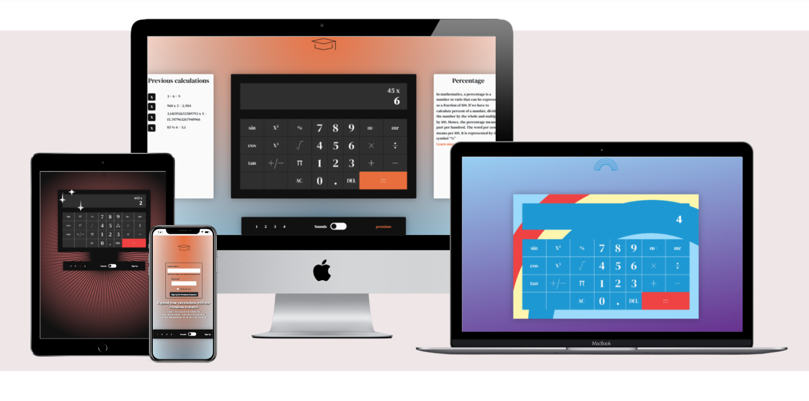
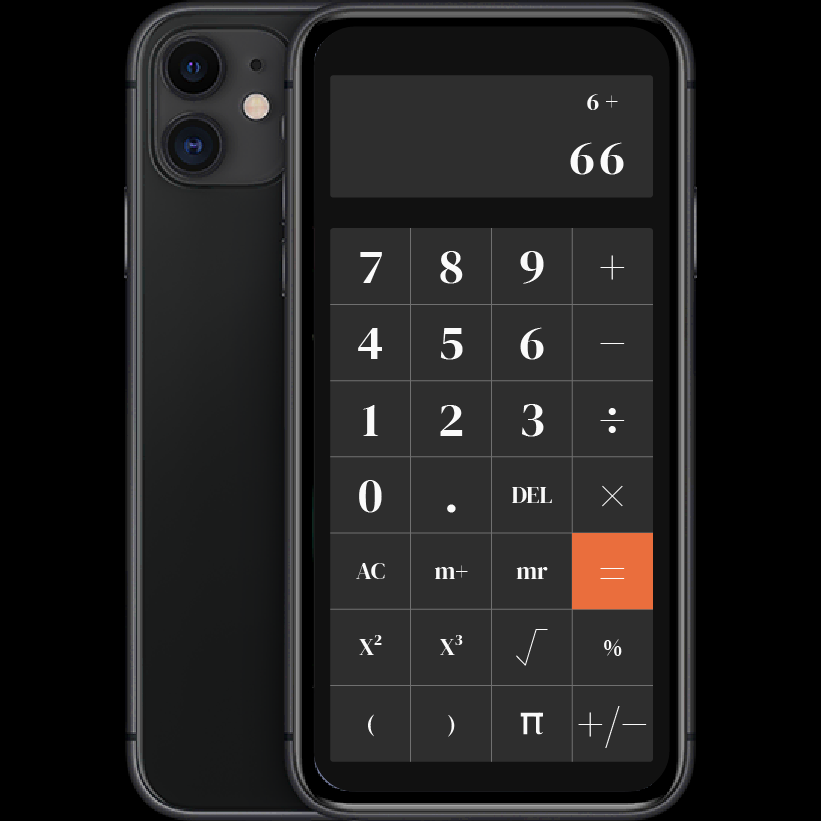

Code Institute Hackathon Functions Anonymous

Wales - UK

Advanced Calculator Web App with Image-based UI 

25th to 27th October 2023

OVERVIEW
========

We have been tasked to make a calculator app using JavaScript, HTML and CSS while adhering to Agile Methodology.  

GOALS
=====

1.  General User's Goal: Users aim to perform a variety of calculations, including percentage-based operations, efficiently and accurately. They also want to store and retrieve calculations from a memory slot (M+ and MR) and access a list of past calculations. 

2.  Site Owner's Goal: To offer a robust, feature-rich calculator that supports various types of calculations, appealing to a wide audience. The aim is to monetize through ads or in-app purchases for additional features. 

SPECIFICATIONS
==============

We aim to deliver a calculator that will be tailored towards a student aged between 16 and 25. It will have the following functions

-   Basic calculator functionality - Addition, Multiplication, Subtraction, Division, Percentage

-   Advanced/intermediate functionality - COS, SIN, TAN, Pi

-   Memory function to store up to 2 values in memory

-   History function to view and repeat previously entered calculations

-   Swappable aesthetic skins

-   Audible feedback when clicking buttons

Day 1
======

Initial Ideation
----------------

A brief outline was discussed and a basic plan was put into place to start fleshing out ideas. It was agreed that we would aim to produce a calculator for a student aged between 16-25 who wanted basic functionality with some advanced features such as SIN COS and TAN. These advanced features should be achievable by using the JavaScript Math namespace.

Rachel suggested the inclusion of premium features that could include tooltips or mini-tutorials and descriptions of some of the buttons on the calculator when hovered over or in a sidebar/modal.

Charles shared a link to his previous research into image mapping. Using a static image as a background onto which the JavaScript (JS) calculator functionality can be mapped. So that 'onclick' listeners tied to specific coordinates will trigger each JS function.

11am to 1pm approx.

Johan has taken on the task of designing some skins that we can use as the background images as .svg scaleable images and providing some wireframes.

Rachel is continuing research into how to code calculator functionality.

Charles is writing user stories.

Paul is documenting.

2pm to 5.30pm approx.

We have code that can be used as a base for our calculator. We continued to discuss what functionality the calculator should have and settled upon it having some trigonometry functions (sin, cos and tan), opening and closing bracket buttons, and a +/- button that will toggle the value in the display between a positive and a negative number.

Johan is refining the wireframes to incorporate these additional buttons. The rest of the team are continuing with research and ad-hoc tasks as determined during ongoing discussions ready for tomorrow.

We have agreed to use a different calculator as a template for modification that will allow us greater control over the functions we want to add to it.

Initial Wireframing and core code for calculator day 1:

Rachel coded a working calculator using resources found online that we will be able to adapt and modify to our own goals

  

Johan has provided a wireframe for our calculator that we can incorporate the code into

Initial wireframe skins for calculator

After some deliberation we decided that the calculator needed 5 extra buttons to better fulfill the brief. This will give the calculator the ability to work out more advanced calculations. 

We decided to go with four different themes for the calculator:\
Academic\
My little pony\
Gothic/Grunge\
Halloween

The initial calculator wireframe and skin designs can be seen below.

We have decided to include some further functionality which will be available to our premium users.\
Our premium users will be able to store all of the calculations in a list to the left of the calculator.\
We will also provide a tip section to the right of the calculator which will provide the user with a short tip about their selected operator and link to learn more from an external source.

USER STORIES

Maths Student:

As a University maths student, I want to be able to access a calculator which can perform complex calculations, so it can aid me in my studies.

As a 6th form maths student, I want to be able to access previous calculations easily, so that I can change them and test them repeatedly.

As a biology student, I want to be able to perform simple calculations quickly, so I don't have to worry about doing any maths in my head.

As a University maths student (who wants more fun from study), I want to have options in how my calculator looks, so that I can feel more engaged with my work.

As a post-grad maths student, i want to be able to save a value and then place that value into a new equation, so that i don't have to remember any complex decimals or scientific notation.

As a maths student, I want to be able to hear the calculator when I click a button, so that it feels more engaging.

As a maths student, I want descriptions for some of the buttons, in case I forget or am not sure of their function.

Business Analyst:

As a business analyst, I want a calculator that can perform statistical functions, so it can aid in my work.

As a business analyst, I want to see the list of my previous calculations so I can easily go back and sum them together.

Freelancer:

As a freelancer, I need a responsive and easy to understand calculator that I can type into from my keyboard, so I can calculate my taxes quickly and efficiently.

As a freelancer, I want a printable list of equations and their answers to provide proof for HMRC.

## Day 1 Team Roles:

Rachel -Lead Dev

Johan - Design

Charles - Project Manager

Paul - Documentation

We have done an initial commit to the main branch which includes the bare bones of a working calculator to which we can add features.

Pull requests are working well. Charles has noted that mapping the clickable areas would work more efficiently if the image files were PNG rather than SVG. Johan has agreed and is proceeding with the change.

11am - Merge conflict issue was resolved. PB reviewed RC's pull request. A merge conflict was resolved with all team members involved, PB needed to delete some commented out code, but then PB was unable to merge the code. It transpired that this was because (as far as we understand it) a code reviewer cannot then confirm the merge if that reviewer has also just resolved conflicts.

A mockup of the premium features/page has been wireframed by Jesse

Snapshot of site taken from gitpod preview at 12.19 - Basic framework and design has been implemented.

# To Do:

calculator functionality, image mapping, sound effects, additional skins, premium features

Image Map issues

We encountered an issue with the image mapping where, upon rendering in chrome browser, the image was showing as having a size of 0,0. We think this is related to the way that we have implemented our calculation functions to use event listeners rather than working with the button ID's to call the functions. We are being assisted by Richey to try and find a workaround.

One solution would be to use a responsive map, this is a complex solution. 

The easiest way to use image maps is to use fixed size images. This would be a compromise and would lose responsiveness. We could change the images to all be 800px width which would be suitable for 80% of screen sizes. The image will be positioned relatively and use 'onclick' to call each calculator function.

Possibly add a media query with a second image and image map for smaller screens to solve the issue we have with it not being responsive.

End of day snapshot taken from gitpod preview 17.07

# To Do for day 2

We have inserted the code for the image map which is working as far as it is listening for and collecting clicks. This can be seen in devtools on Chrome browser where it is outputting errors to the console upon button clicks. A priority will be to tie the JS page and the image map together by assigning classes/listeners/tags to each button in the JS file that the image map can then call. From there we will be able to continue coding additional features as per the specification.

-   Complete image map functionality

-   Add premium features (tooltips/tutorials)

-   Add sound effects

-   Add mute functionality

-   Add history (list of previous calculations) functionality

Interim W3C Validation Tests - 25/10-23 11.30

Interim validation testing was taken on day 1a that produced the following results:

HTML  - <https://validator.w3.org/> 2 errors that will be resolved as we go on as they are related to unclosed tags which will be closed on the final product.

CSS - <https://jigsaw.w3.org/css-validator/> 1 error that can be quickly resolved

JS - <https://beautifytools.com/javascript-validator.php> This resulted in a large number of 'missing semicolon' errors. This boils down to what is essentially a style choice as the code was working and fully functional.

# Day 2

Overnight Rachel was able to link the image mapping to the buttons and get the display to work by adding a div above the main calculator body. So we currently have a functional calculator in all respects with only the additional features to implement (premium, sound effects, history bar).

We have agreed to proceed with the following tasks for the morning:

Johan - Switch cases

Rachel - History sidebar

Charles - Parenthesis

Paul - Premium & Sound effects

All - tidy up JavaScript

To Do - Display not showing sqr button etc - Being looked at by Johan

We got clarification from Richey about the use of chatGPT to assist with our coding. It is OK if we are using it in the correct way. Not to write our code for us. But to check code, find suggestions, find different ways of coding a feature. We must acknowledge chatGPT when it is used.

Interim update 13.20

Calculator is 90% completed. Functionality is good. All operators work as intended except for parenthesis. Sound effects in place. 4 skins plus a premium version of the calculator (needs features adding) is in place.

We are continuing to work on adding the premium features, the calculation history, and tidying up code and fixing minor bugs to do with the display and the parenthesis buttons.

Johan is now working on premium page features while Paul finishes the implementation of a global mute button and updates documentation.

Snapshot of site at 15.03 26/10/2023

W3C Interim Validation 26/10/2023 14.30

During an interim check of the code we found that according to W3C conventions, an <area> element should not have an 'alt' attribute without a 'href' attribute also being present. After discussion we have decided to change the 'alt' attributes on each page to 'aria' labels so that we maintain usability for people with screen readers, and this should comply with W3C validation.

There was also an empty heading on the premium page but that will be corrected as the code is finalised.

Sound effects sourced from <https://pixabay.com/> for rising scale on number buttons

Horror sound effects sourced from <https://www.zapsplat.com/> 

Grunge skin sound effects from <https://samplefocus.com/tag/grunge> and <https://www.myinstants.com/en/instant/smells-like-jumpscare-83370/> 

My Little Pony sound effects from <https://www.101soundboards.com/boards/25446-my-little-pony-friendship-is-magic-soundboard?show_all_sounds=yes>

# Bugs 

ADDING NUMBERS TO COMPUTED ANSWER   

After calculating a sum, the user is able to append extra numbers onto their answer. 
We suspect the issue is within the appendNumber function.

HISTORY UPDATE  

Buttons which automatically calculate their answer without the use of = doe not show up in the previous calculations section.

PARENTHESES

The programming of the parentheses was out of our grasp for this timeframe.

OPERATORS NOT SHOWING IN TOP DISPLAY    

Some of our advanced operators do not show up in our top display. We believe this is to do with the way they are being computed. A potential fix will be to combine aspects of our compute function and our chooseOperation function.

# Future Changes

X^Y BUTTON

Rachel pointed out that it would be better to have a "x^y" button rather than x^2 and x^3 that we currently have.\
This is definitely something to implement in the future as it allows us to include more functionality and gives the user the ability to process more complex calculations.\
The question is, what would we replace the second button with?

RECALLING HISTORY

In our next version the premium users will be able to select previous sums and bring them back to the calculator display from the previous calculations.
Not all of the calculations are stored in the previous calculations, this is due to the difference in the way the advanced calculations are computed. Although we could identify what needed to be done, due to time constraints we were unable to update the javaScript to enable this function to work fully.

CODE REFORMATTING

In our next version we will take time to reformat the code in order to improve efficiency.

RESPONSIVE DESIGN 

Due to the time constraints we decided to avoid working on the responsiveness of the calculator - this was partly due to the fact that the image map would need to be updated for each breakpoint.
The next version of the calculator will be fully responsive. Ensuring that our users will even have access to our product on their phones.

 

# W3C Validation

The website passes W3C HTML checks as evidenced below;

[Index](https://validator.w3.org/nu/?doc=https%3A%2F%2Frichey-ci.github.io%2Ffunctions-anonymous%2Findex.html)

[My Little Pony](https://validator.w3.org/nu/?doc=https%3A%2F%2Frichey-ci.github.io%2Ffunctions-anonymous%2Fmy-little-pony.html)

[Grunge-Gothic](https://validator.w3.org/nu/?doc=https%3A%2F%2Frichey-ci.github.io%2Ffunctions-anonymous%2Fgrunge-gothic.html)

[Halloween](https://validator.w3.org/nu/?doc=https%3A%2F%2Frichey-ci.github.io%2Ffunctions-anonymous%2Fhalloween.html)

[Signup](https://validator.w3.org/nu/?doc=https%3A%2F%2Frichey-ci.github.io%2Ffunctions-anonymous%2Fsignup.html)

[Premium](https://validator.w3.org/nu/?doc=https%3A%2F%2Frichey-ci.github.io%2Ffunctions-anonymous%2Fpremium.html)

A JavaScript validator shows some errors relating to the use of uncalled functions. The functions are being called by the HTML and we believe this is a pecularity of the way the JS checker works. 

## Acknowledgements

 - [Build A Calculator With JavaScript Tutorial - Web Dev Simplified](https://www.youtube.com/watch?v=j59qQ7YWLxw&t=1154s&ab_channel=WebDevSimplified)
 - README Editor ["Readme.so"](https://readme.so/editor)
 - Image Mapper ["image-map.net"](https://www.image-map.net/)
 - Sound Effects ["Pixaby"](https://pixabay.com/) & ["Zapsplat"](https://www.zapsplat.com/) & ["Sample Focus](https://samplefocus.com/tag/grunge) & ["My Instants"](https://www.myinstants.com/en/instant/smells-like-jumpscare-83370/) & ["101 Soundboards](https://www.101soundboards.com/boards/25446-my-little-pony-friendship-is-magic-soundboard?show_all_sounds=yes )
 - Code Checking and Research ["Chat GPT"](https://chat.openai.com/)
 - Stack Overflow
 - W3Schools